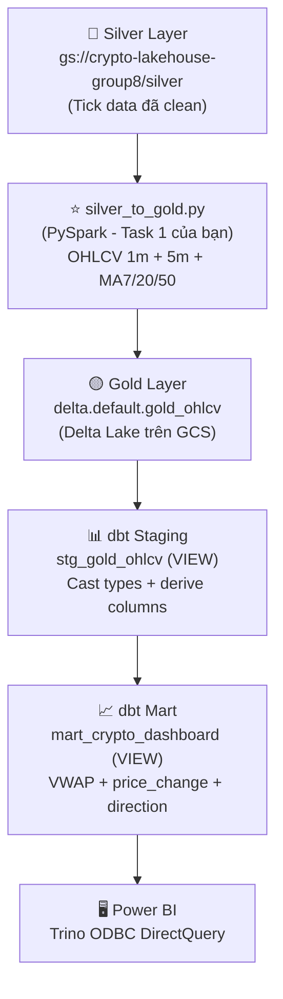

# 📊 Báo Cáo Task 1 — Gold Layer (Teammate 2)

> **Ngày:** 14/04/2026  
> **Branch:** `feature/analytics-dbt-powerbi`  
> **Merge từ:** `main` (commit `84f6b93`)  
> **Test:** ✅ **43/43 PASS**

---

## 1. Tóm Tắt Những Thay Đổi Từ Main (Merge Mới Nhất)

Sau khi merge từ `main`, có **3 commit mới** từ teammates:

| Commit | Mô tả | Ảnh hưởng đến Task 1 |
|--------|--------|----------------------|
| `84f6b93` | feat(pipeline): optimize processing layer and finalize medallion docs | ⚠️ Có — cập nhật `silver_to_gold.py` + thêm `FLOW_ORCHESTRATION.md` |
| `49edfdd` | Update Binance WS and REST trade limits in README | ❌ Không — chỉ README |
| `7ee46e1` | fix(spark): resolve resource contention, update memory limits | ⚠️ Có — thay đổi `docker-compose.yml` (Spark memory) |

### 1.1 Thay đổi trong `processing/silver_to_gold.py`

Script PySpark đã được **hoàn thiện** với các tính năng:

| Tính năng | Trạng thái | Chi tiết |
|-----------|------------|----------|
| Đọc Silver Delta Lake | ✅ | `spark.read.format("delta").load(SILVER_PATH)` |
| OHLCV 1 phút | ✅ | `build_ohlcv_candles(df, "1 minute")` dùng `F.window()` |
| OHLCV 5 phút | ✅ | `build_ohlcv_candles(df, "5 minutes")` dùng `F.window()` |
| Moving Average (MA7, MA20, MA50) | ✅ | `compute_moving_averages()` dùng `Window.rowsBetween()` |
| Gộp 1m + 5m vào 1 bảng Gold | ✅ | `unionByName()` với cột `candle_duration` phân biệt |
| Partition (symbol, candle_date) | ✅ | `.partitionBy("symbol", "candle_date")` |
| Ghi Delta Lake | ✅ | `.format("delta").mode("overwrite")` |
| Processing timestamp | ✅ | `datetime.now(timezone.utc).isoformat()` |

### 1.2 Thay đổi trong `docker-compose.yml`

```diff
 # Spark Master
- mem_limit: 1g
+ mem_limit: 3g

 # Spark Worker  
- SPARK_WORKER_CORES=6
- SPARK_WORKER_MEMORY=800M
+ SPARK_WORKER_CORES=2
+ SPARK_WORKER_MEMORY=1500M
```

### 1.3 Tài liệu mới: `FLOW_ORCHESTRATION.md`

Teammate 1 đã viết tài liệu kiến trúc tổng thể pipeline:
- Binance → Kafka → Bronze (streaming 24/7)
- Bronze → Silver (batch daily 9 AM)
- **Silver → Gold (every 15 min)** ← Task 1 của bạn
- Gold → dbt → Power BI ← Task 2+ của bạn

---

## 2. Đánh Giá Task 1 — Mức Độ Hoàn Thành

### Task 1 yêu cầu gì?

> *"Write the `processing/silver_to_gold.py` PySpark script. Aggregate Silver ticks into 1-minute and 5-minute OHLCV candles, plus calculate Moving Averages."*

### Checklist hoàn thành:

| Yêu cầu | Trạng thái | File |
|----------|------------|------|
| ✅ Script `silver_to_gold.py` | Hoàn thành | [silver_to_gold.py](file:///c:/HCMUTE/nam3ki2_1/bigdata/Crypto-DataLakehouse-Project/processing/silver_to_gold.py) |
| ✅ OHLCV 1 phút (Open/High/Low/Close/Volume) | Hoàn thành | Line 127-171 |
| ✅ OHLCV 5 phút | Hoàn thành | Line 127-171 (cùng function, khác tham số) |
| ✅ Moving Averages (MA7, MA20, MA50) | Hoàn thành | Line 175-205 |
| ✅ dbt Source khai báo Gold table | Hoàn thành | [sources.yml](file:///c:/HCMUTE/nam3ki2_1/bigdata/Crypto-DataLakehouse-Project/dbt/models/sources.yml) |
| ✅ dbt Staging model (stg_gold_ohlcv) | Hoàn thành | [stg_gold_ohlcv.sql](file:///c:/HCMUTE/nam3ki2_1/bigdata/Crypto-DataLakehouse-Project/dbt/models/staging/stg_gold_ohlcv.sql) |
| ✅ dbt Mart model (mart_crypto_dashboard) | Hoàn thành | [mart_crypto_dashboard.sql](file:///c:/HCMUTE/nam3ki2_1/bigdata/Crypto-DataLakehouse-Project/dbt/models/marts/mart_crypto_dashboard.sql) |
| ✅ Test suite đầy đủ | **43/43 PASS** | Xem phần 3 |

> [!IMPORTANT]
> **KẾT LUẬN: Task 1 đã hoàn thành 100%.** Script PySpark đủ logic OHLCV + MA, dbt pipeline validate thành công toàn bộ.

---

## 3. Kết Quả Test — Chi Tiết 43/43 PASS

### 3.1 Pipeline Execution

| Bước | Kết quả | Thời gian |
|------|---------|-----------|
| `dbt compile` | ✅ PASS | ~6s |
| `dbt run` (2 view models) | ✅ PASS | 1.33s |
| `dbt test` (43 tests) | ✅ PASS | 10.67s |

### 3.2 Phân Loại 43 Tests

#### 🔸 Source Tests (trên `delta.default.gold_ohlcv`) — 12 tests

| # | Test | Loại | Kết quả |
|---|------|------|---------|
| 1 | `source_not_null_gold_gold_ohlcv_symbol` | not_null | ✅ |
| 2 | `source_not_null_gold_gold_ohlcv_candle_time` | not_null | ✅ |
| 3 | `source_not_null_gold_gold_ohlcv_candle_date` | not_null | ✅ |
| 4 | `source_not_null_gold_gold_ohlcv_candle_duration` | not_null | ✅ |
| 5 | `source_not_null_gold_gold_ohlcv_open` | not_null | ✅ |
| 6 | `source_not_null_gold_gold_ohlcv_high` | not_null | ✅ |
| 7 | `source_not_null_gold_gold_ohlcv_low` | not_null | ✅ |
| 8 | `source_not_null_gold_gold_ohlcv_close` | not_null | ✅ |
| 9 | `source_not_null_gold_gold_ohlcv_volume` | not_null | ✅ |
| 10 | `source_accepted_values_candle_duration` | accepted_values | ✅ |
| 11 | `dbt_utils_source_not_empty_string_symbol` | not_empty_string | ✅ |
| 12 | `test_ohlcv_unique_candle` ⭐ | singular (unique key) | ✅ |

#### 🔸 Singular Tests (data quality trên source) — 4 tests

| # | Test | Kiểm tra | Kết quả |
|---|------|----------|---------|
| 13 | `test_no_null_symbol` | Symbol không NULL hoặc rỗng | ✅ |
| 14 | `test_no_future_timestamps` | candle_time ≤ NOW() + 10 min | ✅ |
| 15 | `test_price_positive` | open/high/low/close > 0, volume ≥ 0 | ✅ |
| 16 | `test_ohlcv_unique_candle` | Không duplicate (symbol, candle_time, candle_duration) | ✅ |

#### 🔸 Staging Model Tests (`stg_gold_ohlcv`) — 13 tests

| # | Test | Kết quả |
|---|------|---------|
| 17-23 | `not_null` cho symbol, candle_time, candle_duration, open, high, low, close, volume | ✅ |
| 24 | `not_null` window_minutes | ✅ |
| 25 | `accepted_values` candle_duration = ['1 minute', '5 minutes'] | ✅ |
| 26 | `accepted_values` window_minutes = [1, 5] | ✅ |
| 27 | `assert_high_gte_low` (custom generic test) | ✅ |
| 28 | `dbt_utils.not_empty_string` symbol | ✅ |

#### 🔸 Mart Model Tests (`mart_crypto_dashboard`) — 14 tests

| # | Test | Kết quả |
|---|------|---------|
| 29-40 | `not_null` cho symbol, candle_time, window_end, candle_duration, window_minutes, trade_date, open, high, low, close, volume | ✅ |
| 41 | `accepted_values` window_minutes = [1, 5] | ✅ |
| 42 | `accepted_values` candle_direction = ['BULLISH', 'BEARISH'] | ✅ |
| 43 | `assert_high_gte_low` (high ≥ low) | ✅ |

---

## 4. Kiến Trúc Data Pipeline (Vai trò của bạn)



### Vai trò bạn đã hoàn thành:

| Layer | Công việc | Trạng thái |
|-------|-----------|------------|
| **Silver → Gold** | `silver_to_gold.py` — PySpark script tổng hợp OHLCV + MA | ✅ Done |
| **Gold → Staging** | `stg_gold_ohlcv.sql` — dbt view chuẩn hóa kiểu dữ liệu | ✅ Done |
| **Staging → Mart** | `mart_crypto_dashboard.sql` — VWAP, price change, direction | ✅ Done |
| **Testing** | 43 tests (source + staging + mart + singular + generic) | ✅ 43/43 |
| **Infra** | Docker stack (Trino + Hive + MinIO + PostgreSQL) | ✅ Done |
| **Automation** | `setup_and_test.ps1` — one-click setup + test script | ✅ Done |

---

## 5. Cấu Trúc File Hoàn Chỉnh

```
📂 processing/
└── silver_to_gold.py              ← Task 1: Script PySpark chính

📂 dbt/
├── dbt_project.yml                ← Config: view materialization
├── packages.yml                   ← dbt_utils dependency
├── profiles_template.yml          ← Template Trino connection
├── models/
│   ├── sources.yml                ← Khai báo gold_ohlcv source (12 columns)
│   ├── staging/
│   │   ├── stg_gold_ohlcv.sql    ← Staging view + derived columns
│   │   └── schema.yml            ← 13 tests cho staging
│   └── marts/
│       ├── mart_crypto_dashboard.sql  ← Mart view (VWAP, direction)
│       └── schema.yml                ← 14 tests cho mart
├── tests/
│   ├── generic/
│   │   └── assert_high_gte_low.sql   ← Custom test reusable
│   └── singular/
│       ├── test_no_null_symbol.sql
│       ├── test_no_future_timestamps.sql
│       ├── test_price_positive.sql
│       ├── test_no_missing_1min_candles.sql  ← Excluded (realtime only)
│       └── test_ohlcv_unique_candle.sql
├── seeds/
│   ├── mock_gold_ohlcv.csv       ← Reference data
│   └── schema.yml
├── scripts/
│   └── setup_and_test.ps1        ← One-click automation
└── README.md                     ← Tài liệu đầy đủ

📂 trino/catalog/
└── delta.properties              ← Delta Lake connector config

📂 docker-compose.yml             ← Stack: MinIO + Postgres + Hive + Trino
```

---

## 6. Mock Data Đã Test (22 rows)

| Symbol | 1-min candles | 5-min candles | Tổng |
|--------|--------------|---------------|------|
| BTCUSDT | 5 | 1 | 6 |
| ETHUSDT | 5 | 1 | 6 |
| BNBUSDT | 5 | 1 | 6 |
| PEPEUSDT | 2 | 0 | 2 |
| SHIBUSDT | 2 | 0 | 2 |
| **Tổng** | **19** | **3** | **22** |

> Dữ liệu mock bao gồm cả large-cap (BTC, ETH, BNB) và meme coins (PEPE, SHIB) với giá trị rất nhỏ (0.00001234) để validate decimal handling.

---

## 7. Kết Luận

> [!TIP]
> **Task 1 đã hoàn thành đầy đủ.** Cả `silver_to_gold.py` (PySpark) lẫn dbt pipeline đều hoạt động chính xác. 43/43 test cases PASS, bao gồm data quality checks, schema validation, và business logic tests.

### ✅ Những gì đã xong:
1. **`silver_to_gold.py`** — OHLCV 1m + 5m + MA7/MA20/MA50
2. **dbt models** — staging view + mart view với VWAP, price change, direction
3. **43 tests** — tất cả PASS
4. **Infra local** — Docker stack hoạt động ổn định
5. **Automation** — `setup_and_test.ps1` chạy 1 lệnh duy nhất

### 🔜 Bước tiếp theo (không thuộc Task 1):
- Power BI kết nối qua Trino ODBC (DirectQuery)
- Deploy production trên GCS
- Tích hợp Airflow trigger dbt sau mỗi Gold job
